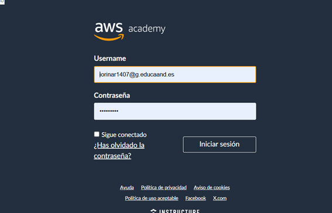
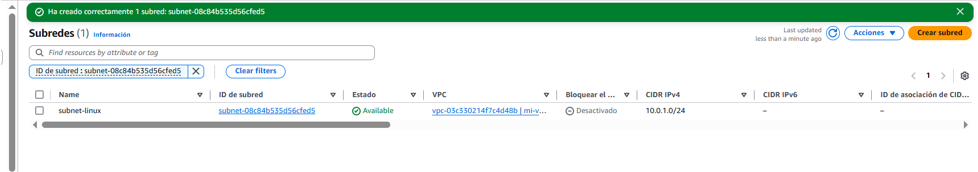
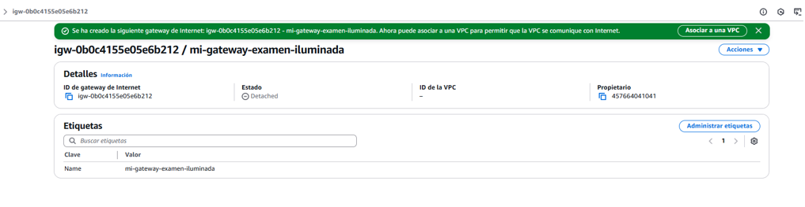
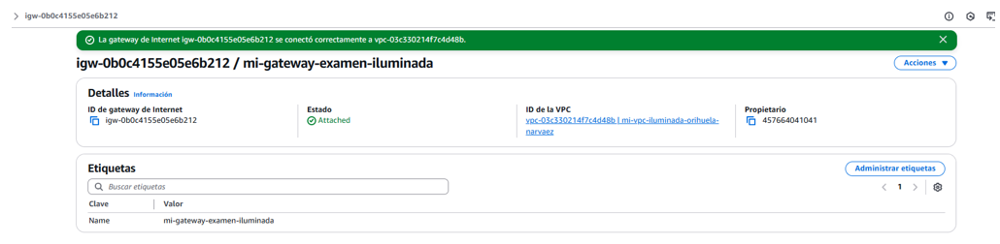
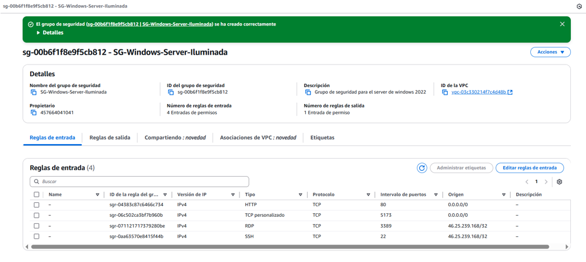
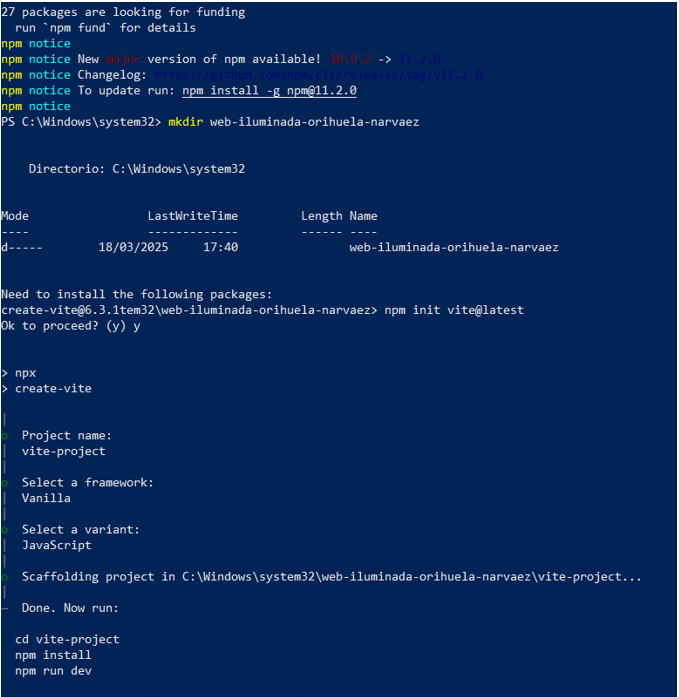
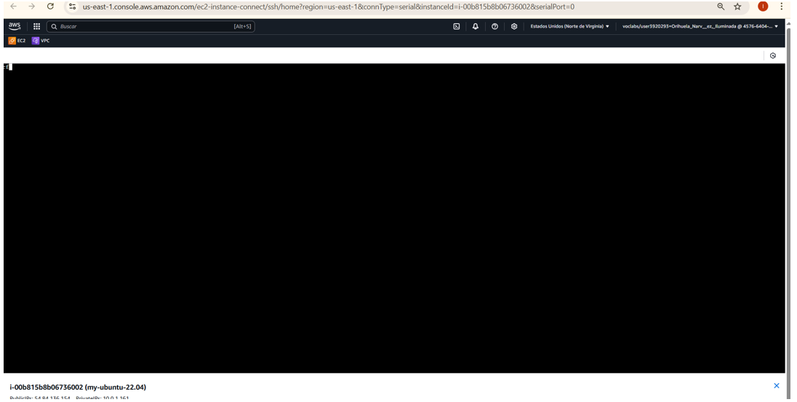
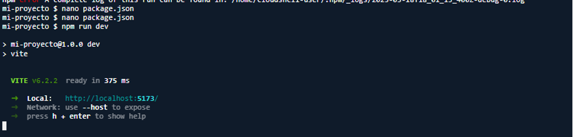

# Aws-Examen-Web-Iluminada-Orihuela-Narvaez

He creado una VPC con dos instancias EC2 y he desplegado una página web con Vite en ambas máquinas.

## Inicio sesión en AWS

- Lo primero fue crear una VPC llamada mi-vpc-Iluminada-Orihuela-Narvaez y con CIDR: 10.0.0.0/16. Luego, dentro de esa VPC, configuré dos subredes:
subnet-linux → CIDR 10.0.1.0/24
subnet-windows → CIDR 10.0.2.0/24
- Para que las instancias pudieran conectarse a Internet, le añadí una Internet Gateway a la VPC y la configuré en la tabla de rutas con 0.0.0.0/0.

## Modifico la tabla de rutas para permitir tráfico a Internet

## Creo los grupos de seguridad

Para que las webs fueran accesibles desde cualquier lugar, configuré los Security Groups con estas reglas:

Reglas de entrada (INBOUND)

•	HTTP (80) → Abierto para todo 0.0.0.0/0

•	Vite (5173) → Abierto para todo 0.0.0.0/0

•	SSH (22) → Solo desde mi IP pública (Linux)

•	RDP (3389) → Solo desde mi IP pública (Windows)

Reglas de salida (OUTBOUND)

•	Todo el tráfico permitido 0.0.0.0/0

## Luego levanté dos máquinas virtuales en AWS:

Instancia Windows
   
SO: Windows Server 2022

Tipo: t3.medium

Subred: subnet-windows

Reglas de Seguridad: 

  HTTP (80)
  
  Vite (5173)
  
  RDP (3389) 
  
Instancia Linux (Ubuntu 22.04)

SO: Ubuntu 22.04

IP pública asignada

Subred: subnet-linux

Reglas de Seguridad: 

  HTTP (80)

  Vite (5173)
  
  SSH (22) (para conectarme por terminal)
  

## Instalación y despliegue de Web
Para poder desplegar una web, en ambas instancias instalé Node.js y Vite, que sirven para desarrollar y correr aplicaciones web.
En cada máquina creé un proyecto web con Vite, que genera una estructura básica para una web en JavaScript.

## Conectarme a las instancias

Windows:

Linux:

## Pull request a un compañero

